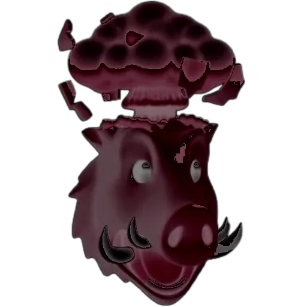

# randboar_tgbot
Bot that creates random boar sticker

> Made for [this](https://t.me/THIS_IS_JUST_A_TEST) tg chat

Bot generates random variations of boar sticker, blending \[randomly] generated BnW mask with \[randomly] hue-shifted original image

  
  <em>Original sticker</em>

  
  <em>Mask example</em>

  
  <em>Output example (not based on example mask)</em>

